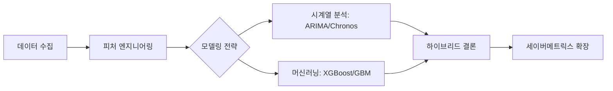

# ⚾ KBO & MLB 관중 수 예측 분석 및 세이버메트릭스 확장 프로젝트

## 👥 팀 정보
* **팀명**: 올해는 우승
* **구성원**: 최서연(팀장), 허수빈

---

## 1. 프로젝트 개요 (Project Overview)
> **"야구 관중 수는 단순한 시계열 흐름인가, 아니면 복합적인 이벤트의 결과인가?"**
본 프로젝트는 KBO와 MLB의 방대한 데이터를 바탕으로 관중 수 변동을 유발하는 핵심 요인을 분석합니다. 시계열 모델의 한계를 머신러닝 하이브리드 전략으로 극복하고, 이를 세이버메트릭스 지표와 결합하여 스포츠 데이터의 비즈니스적 가치를 증명합니다.

---

## 2. 분석 아키텍처 (Analysis Architecture)

---

## 3. 데이터 수집 및 파이프라인 (Data Pipeline)

| 구분 | 수집 소스 | 주요 내용 |
| :--- | :--- | :--- |
| **KBO 데이터** | KBO 공식 홈페이지, 네이버 스포츠 | 23~25시즌 관중 수, 대진표, 경기 결과 (크롤링) |
| **환경 데이터** | 기상청 기상자료개방포털 | 구장별 기온, 강수량, 습도 등 6개 기상 변수 |
| **MLB 데이터** | MLB Stats API, pybaseball | 표준화된 글로벌 야구 지표 및 선수 ID 데이터 |

---

## 4. 핵심 피처 엔지니어링 (Feature Engineering)

* **🌡️ 환경 변수**: 기온+습도를 조합한 **불쾌지수(DI)** 산출 (체감 날씨 반영)
* **📅 일정의 가치**: 주말/공휴일을 통합한 **'황금연휴' 가중치** 및 경기 시작 시간 인코딩
* **🔥 팀 모멘텀**: 최근 10경기 승률 기반의 **'기세'**와 시즌 진행률을 곱한 **'순위 경쟁도'**
* **⚔️ 라이벌리**: 잠실 더비, 엘롯라시코 등 **특수 매치업 이진화(Binary Encoding)**

---

## 5. 탐색적 데이터 분석 (EDA) 핵심 인사이트

> ### 🔍 흥행을 결정짓는 Top 5 요인
> 1. **홈팀 팬덤 규모 (0.54)**: 구단별 고정 충성도가 예측의 베이스라인 형성
> 2. **구장 수용 인원 (0.50)**: 물리적 한계치가 관중 수의 상한선(Upper Bound) 결정
> 3. **휴일 및 일정 (0.37)**: 황금연휴 여부가 평일 대비 압도적 관중 수 유발
> 4. **에어컨 효과**: 8월 폭염 시기, 고척 돔구장 점유율의 독보적 상승 확인
> 5. **가을야구 버프**: 시즌 진행률 80% 이상 시점부터 가을야구권 팀 관중 15% 급증

---

## 6. 모델링 전략 및 성능 비교 (Modeling)

### 6.1 시계열 vs 머신러닝 성능 지표

| 모델 구분 | 모델명 | 주요 특징 | $R^2$ / MAPE |
| :--- | :--- | :--- | :--- |
| **시계열 (Baseline)** | ARIMA / Chronos | 과거 추세 중심, 외부 변수 반영 약함 | 저조 (평균 회귀 발생) |
| **KBO ML (Final)** | **XGBoost & Stacking** | 요일, 날씨, 대진 등 이벤트 민감 대응 | **$R^2$: 0.7968** |
| **MLB ML (Final)** | **GBM Ensemble** | MLB API의 정밀한 선발투수 데이터 반영 | **MAPE: 6.6%** |

---

## 7. 심층 분석: 왜 머신러닝 수치가 더 높게 나오는가?

> **⚠️ 주의: 수치상의 성능과 실제 예측력의 차이**
> 
> * **패턴의 암기 (Memorization)**: 랜덤 분할(Random Split) 시, 모델이 과거의 '같은 상대, 같은 요일, 같은 날씨'의 결과를 사실상 **암기**하여 정답을 맞출 가능성이 높습니다. (Data Leakage 위험)
> * **시계열의 정석**: 반면 시계열 모델은 '미래의 날짜'만 보고 예측해야 하므로 수치가 낮게 나오지만, 실제 미래 예측 상황에 더 가까운 시뮬레이션입니다.
> * **결론**: 본 프로젝트의 높은 ML 성능은 **"특정 환경 변수가 주어졌을 때 관중의 반응을 얼마나 민감하게 포착하는가"**를 보여주는 지표로 해석해야 합니다.

---

## 8. 세이버메트릭스(Sabermetrics) 확장

* **wRC+ (조정 득점 창출력)**: 타자의 순수 생산성과 팀 승리 기여도 상관분석
* **WAR (승리 기여도)**: 스타 플레이어의 존재가 관중 동원력에 미치는 '티켓 파워' 수치화
* **인사이트**: 숫자로 기록된 선수 데이터는 결국 관중의 방문을 유도하는 가장 강력한 본질적 요인임을 증명

---

## 9. 최종 결론 (Conclusion)

1.  **예측 너머의 분석**: 야구 데이터의 가치는 단순한 미래 관중 수 예측이 아니라, **'어떤 요인이 관중을 움직이는가'**를 밝히는 데 있습니다.
2.  **하이브리드 체계**: 반복되는 시즌 패턴은 **시계열**로, 돌발적인 이벤트(선발투수 변경, 기상 악화)는 **머신러닝**으로 보완하는 전략이 최적입니다.
3.  **비즈니스 활용**: 본 모델은 구단 마케팅 팀이 관중 감소가 예상되는 날을 미리 파악하여 특화된 프로모션을 기획하는 의사결정 도구로 활용될 수 있습니다.

---
